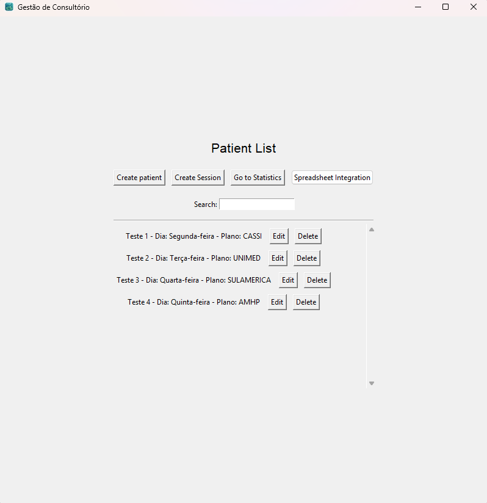
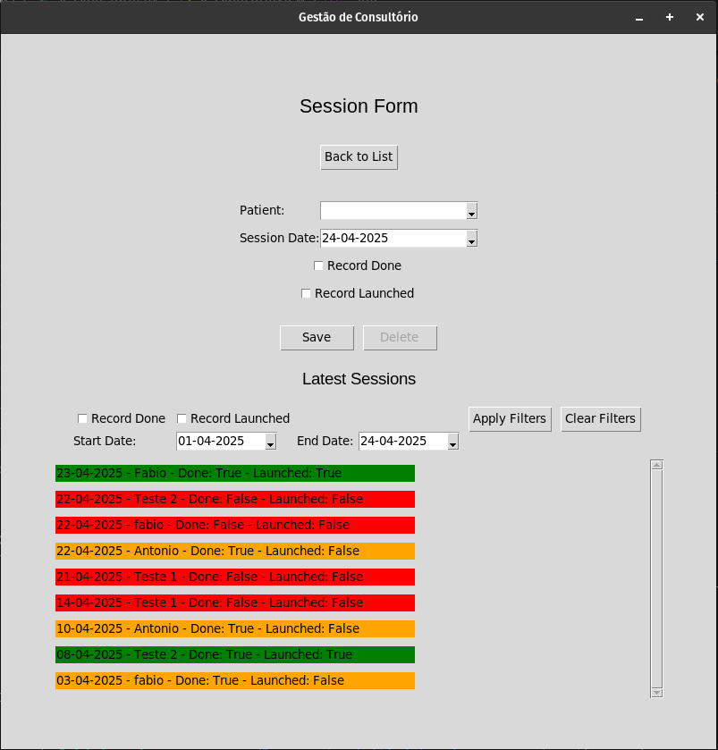
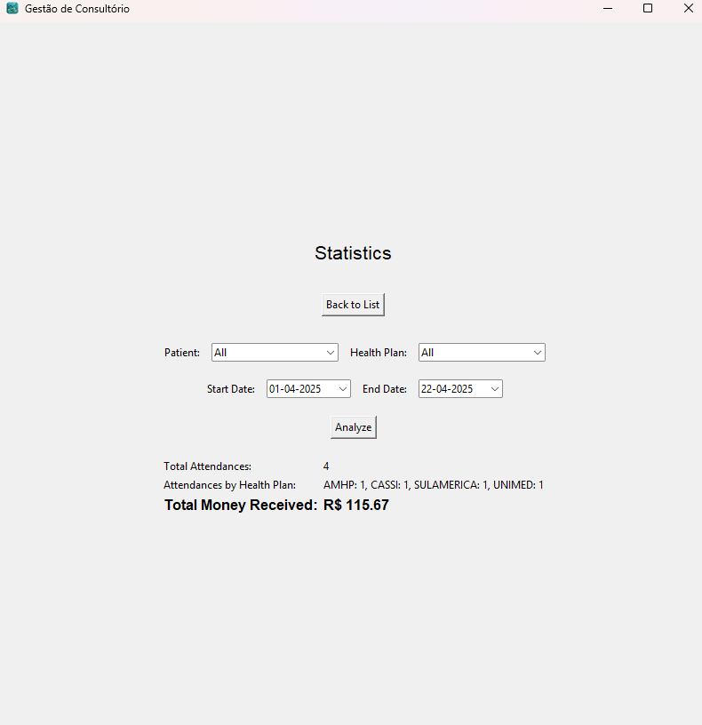

# My Income Psy 💲📊

**My Income Psy** é uma aplicação de desktop para psicólogos e terapeutas gerenciarem pacientes, sessões de atendimento e acompanhar análises financeiras de seus atendimentos.

## 📋 Índice

- [Funcionalidades](#-funcionalidades)
- [Tecnologias Utilizadas](#-tecnologias-utilizadas)
- [Requisitos](#-requisitos)
- [Instalação](#-instalação)
- [Como Utilizar](#-como-utilizar)
- [Estrutura do Projeto](#-estrutura-do-projeto)
- [Contribuição](#-contribuição)
- [Licença](#-licença)

## ✨ Funcionalidades

- **Gerenciamento de Pacientes**: Cadastro, edição e exclusão de pacientes com informações como nome, dia de atendimento, horário, plano de saúde, valor da clínica e percentual do terapeuta.
- **Controle de Sessões**: Registro de atendimentos realizados com data, paciente, e status de prontuário (feito/lançado).
- **Análise Financeira**: Visualização de estatísticas como total de atendimentos, atendimentos por convênio e receita total.
- **Filtros Avançados**: Possibilidade de filtrar as análises por paciente ou plano de saúde.
- **Interface Visual**: Interface de usuário intuitiva com destaque visual para sessões pendentes.

## 🔧 Tecnologias Utilizadas

- **Python**: Linguagem de programação principal
- **Tkinter**: Biblioteca para criação da interface gráfica
- **SQLAlchemy**: ORM (Object-Relational Mapping) para interação com o banco de dados
- **SQLite**: Banco de dados embutido para armazenamento local
- **Alembic**: Ferramenta para migração de banco de dados
- **tkcalendar**: Componente de calendário para seleção de datas

## 📋 Requisitos

- Python 3.8+
- Bibliotecas listadas no arquivo `requirements.txt`

## 🚀 Instalação

1. Clone o repositório:
   ```bash
   git clone https://github.com/seu-usuario/my_income_psy.git
   cd my_income_psy
   ```

2. Crie e ative um ambiente virtual (recomendado):
   ```bash
   python -m venv venv
   # No Windows
   venv\Scripts\activate
   # No macOS/Linux
   source venv/bin/activate
   ```

3. Instale as dependências:
   ```bash
   pip install -r requirements.txt
   ```

4. Execute as migrações do banco de dados:
   ```bash
   alembic upgrade head
   ```

5. Inicie a aplicação:
   ```bash
   python main.py
   ```

## 🛠️ Geração do Executável

Para gerar um executável da aplicação, siga os passos abaixo:

1. Certifique-se de que você tenha o **PyInstaller** instalado. Se não tiver, instale-o usando o seguinte comando:
   ```bash
   pip install pyinstaller
   ```

2. Navegue até o diretório do projeto onde o arquivo `main.py` está localizado.

3. Execute o seguinte comando para gerar o executável:
   ```bash
   pyinstaller --onefile --icon=assets/icon.ico --noconsole main.py 
   ```

4. Após a execução do comando, o executável será gerado na pasta `dist/`. Você pode encontrar o arquivo chamado `my_income_psy.exe` dentro dessa pasta.

5. Para executar a aplicação, basta abrir o terminal, navegar até a pasta `dist/` e executar:
   ```bash
   ./my_income_psy.exe
   ```

Agora você pode usar a aplicação como um executável independente!

## 📝 Como Utilizar

### Gerenciamento de Pacientes



1. Na tela inicial, você verá a lista de pacientes cadastrados
2. Para adicionar um novo paciente, clique no botão "Create Patient" e preencha o formulário
3. Para editar um paciente existente, clique sobre o botão "Edit" a frente dos dados do paciente na lista
4. Para excluir um paciente, clique sobre o botão "Delete" a frente dos dados do paciente na lista

### Registro de Sessões



1. Na tela inicial, clique no botão "Create Session" para acessar o controle de sessões
2. Selecione o paciente, a data do atendimento e marque os status de prontuário
2. 1. "Record Done" se refere aos prontuários que já foram registrados pelo terapeuta
2. 2. "Record Launched" se refere aos prontuários que já foram salvos no sistema proprietário da clínica
3. Clique em "Salvar" para registrar a sessão
4. Para editar uma sessão, clique sobre ela na lista de sessões recentes
5. Para excluir uma sessão, selecione-a e clique no botão "Delete"

### Visualização de Estatísticas



1. Acesse a tela de estatísticas através do menu principal
2. Defina o período de análise selecionando as datas de início e fim
3. Utilize os filtros para analisar um paciente específico ou um plano de saúde
4. Visualize o total de atendimentos, distribuição por convênio e receita total

### Integração com Planilhas


1. Acesse a tela de integração com planilhas através do menu principal.
2. Clique no botão "Open spreadsheet" para selecionar um arquivo de planilha existente para importar dados. (observe que, se houver ids repetidos ou em comum com a base de dados, a importação irá falhar. Os ids devem ser sequênciais aos já existentes na base de dados)
3. Após selecionar o arquivo, a aplicação importará os dados da planilha.
4. Clique no botão "Save spreadsheet" para salvar os dados atuais em um novo arquivo de planilha.
5. Escolha o local e o nome para o novo arquivo de planilha e clique em "Salvar" para exportar os dados.

## 📁 Estrutura do Projeto

```
my_income_psy/
│
├── main.py                 # Ponto de entrada da aplicação
├── controller.py           # Controlador principal da aplicação
│
├── src/
│   ├── models/
│   │   ├── models.py       # Definição dos modelos de dados
│   │   └── database.py     # Configuração do banco de dados
│   ├── IncomeAnalysis.py   # Classe para análise financeira
│   └── utils.py            # Funções utilitárias
│
├── views/
│   ├── patient_list.py     # Visualização da lista de pacientes
│   ├── patient_form.py     # Formulário de pacientes
│   ├── session_form.py     # Formulário de sessões
|   ├── spreadsheet_integration_form.py # Formulário da integração de planilhas com o banco de dados
│   └── statistics_form.py       # Visualização de estatísticas
│
├── alembic/                # Configuração e scripts de migração
│   ├── versions/           # Versões das migrações
│   ├── env.py              # Ambiente Alembic
│   └── alembic.ini         # Configuração Alembic
│
├── assets/                 # Recursos estáticos (imagens, ícones)
│
└── requirements.txt        # Dependências do projeto
```

## 🤝 Contribuição

Contribuições são bem-vindas! Siga estas etapas para contribuir:

1. Faça um fork do projeto
2. Crie uma branch para sua feature (`git checkout -b feature/nova-funcionalidade`)
3. Faça commit das suas alterações (`git commit -m 'Adiciona nova funcionalidade'`)
4. Envie para a branch (`git push origin feature/nova-funcionalidade`)
5. Abra um Pull Request

### Diretrizes de Contribuição

- Mantenha o código limpo e bem documentado
- Siga as convenções de código do projeto
- Atualize a documentação quando necessário

## 📄 Licença

Este projeto está licenciado sob a licença MIT - veja o arquivo [LICENSE](LICENSE) para detalhes.

---

## 📬 Contato

Para sugestões, dúvidas ou feedback, por favor, abra uma issue no GitHub ou entre em contato através de [psifabiohenrique@outlook.com](mailto:psifabiohenrique@outlook.com).

---